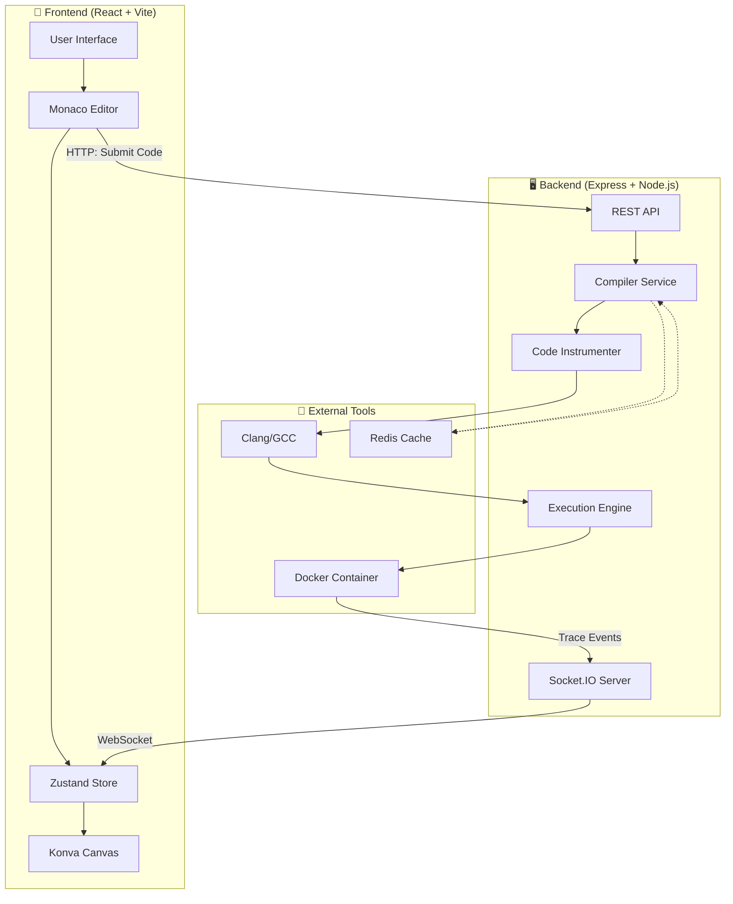
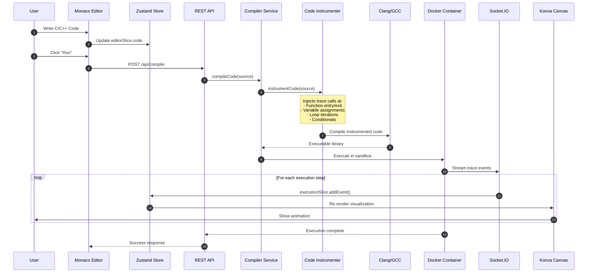
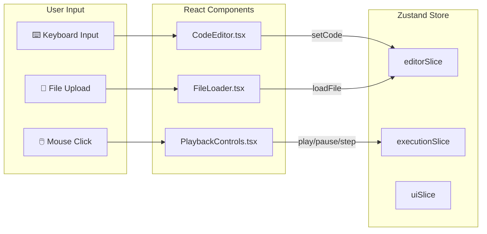
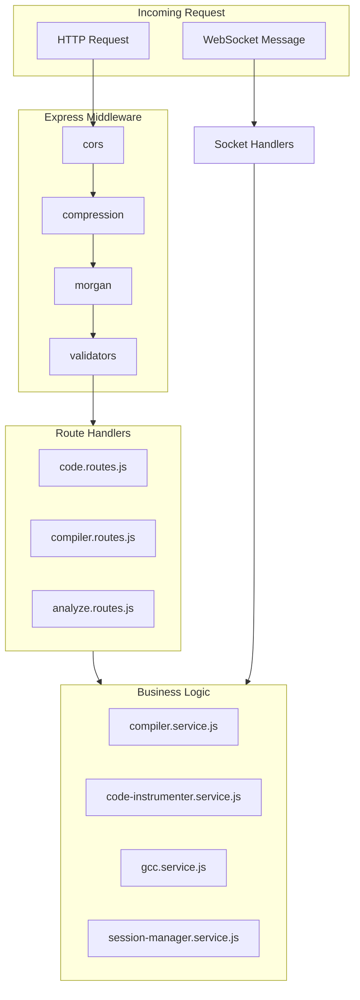
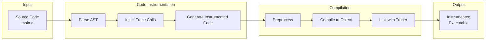
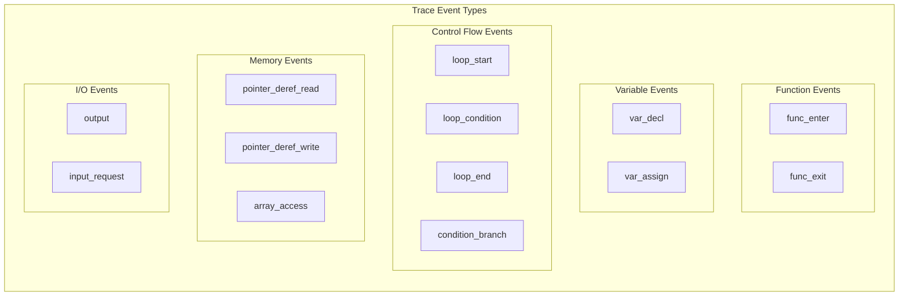
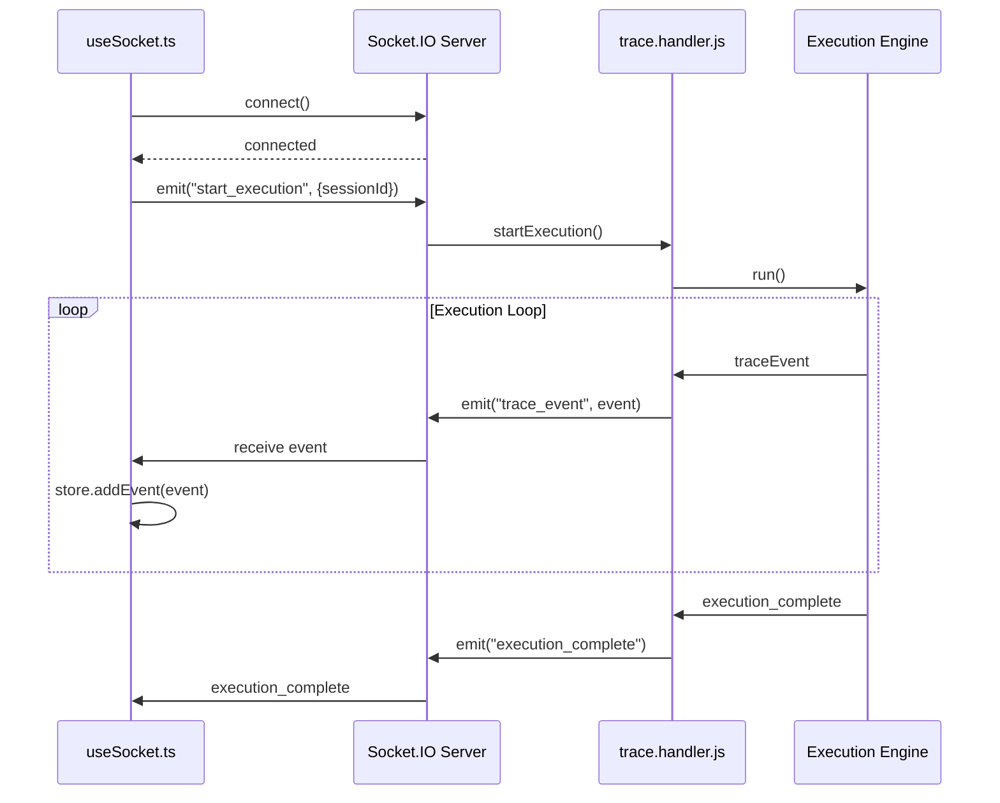
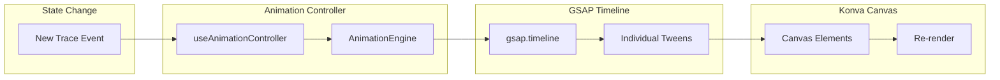
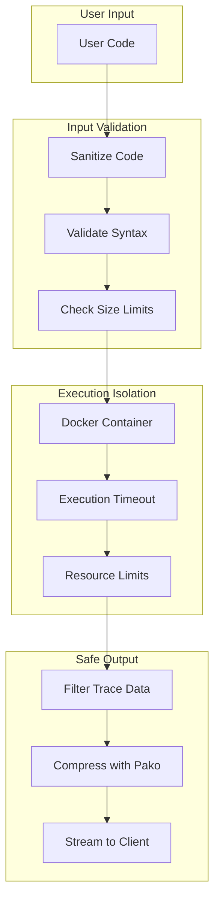

# 🔄 Code Flow & Data Flow Documentation

A comprehensive guide to understanding how data flows through the **C/C++ Program Execution Visualizer**.

---

## 📊 High-Level Architecture



---

## 🚀 Complete Code Execution Flow

### Step-by-Step Process



---

## 📁 Frontend Data Flow

### 1. User Input Flow



### 2. State Management Flow

```mermaid
flowchart TB
    subgraph Slices["Zustand Slices"]
        direction TB
        editor[editorSlice<br/>- code<br/>- language<br/>- errors]
        execution[executionSlice<br/>- events[]<br/>- currentStep<br/>- isPlaying]
        canvas[canvasSlice<br/>- zoom<br/>- pan<br/>- selection]
        ui[uiSlice<br/>- theme<br/>- panels<br/>- modals]
        gcc[gccSlice<br/>- status<br/>- errors<br/>- warnings]
        input[inputSlice<br/>- pendingInput<br/>- inputHistory]
        loop[loopSlice<br/>- collapsed[]<br/>- activeLoop]
    end
    
    subgraph Actions["User Actions"]
        write[Write Code]
        run[Run Program]
        step[Step Through]
        zoom[Zoom/Pan]
    end
    
    write --> editor
    run --> execution
    run --> gcc
    step --> execution
    zoom --> canvas
    
    execution -->|getCurrentEvent| canvas
```

### 3. Component Data Flow

```
┌─────────────────────────────────────────────────────────────────────────┐
│                              App.tsx                                     │
│  ┌─────────────────────────────────────────────────────────────────────┐│
│  │                        Allotment (Split Panels)                      ││
│  │  ┌─────────────────────┐     ┌─────────────────────────────────────┐││
│  │  │   Left Panel        │     │         Right Panel                  │││
│  │  │  ┌───────────────┐  │     │  ┌───────────────────────────────┐  │││
│  │  │  │ CodeEditor    │  │     │  │    VisualizationCanvas        │  │││
│  │  │  │ (Monaco)      │  │     │  │    (Konva + react-konva)      │  │││
│  │  │  │               │  │     │  │                               │  │││
│  │  │  │ Data In:      │──┼─────┼──│ Data In:                      │  │││
│  │  │  │ - code        │  │     │  │ - events[]                    │  │││
│  │  │  │ - language    │  │     │  │ - currentStep                 │  │││
│  │  │  │ - currentLine │  │     │  │ - variables                   │  │││
│  │  │  │               │  │     │  │ - functions                   │  │││
│  │  │  │ Data Out:     │  │     │  │ - memory                      │  │││
│  │  │  │ - onChange    │  │     │  │ - pointers                    │  │││
│  │  │  │ - onRun       │  │     │  │                               │  │││
│  │  │  └───────────────┘  │     │  │ Renders:                      │  │││
│  │  │  ┌───────────────┐  │     │  │ - VariableBox                 │  │││
│  │  │  │PlaybackControl│  │     │  │ - FunctionFrame               │  │││
│  │  │  │               │  │     │  │ - PointerArrow                │  │││
│  │  │  │ Data In:      │  │     │  │ - MemoryBlock                 │  │││
│  │  │  │ - isPlaying   │  │     │  │ - ExplanationBox              │  │││
│  │  │  │ - currentStep │  │     │  │ - OutputElement               │  │││
│  │  │  │ - totalSteps  │  │     │  └───────────────────────────────┘  │││
│  │  │  │               │  │     │                                      ││
│  │  │  │ Data Out:     │  │     │                                      ││
│  │  │  │ - onPlay      │  │     │                                      ││
│  │  │  │ - onPause     │  │     │                                      ││
│  │  │  │ - onStep      │  │     │                                      ││
│  │  │  │ - onSeek      │  │     │                                      ││
│  │  │  └───────────────┘  │     │                                      ││
│  │  └─────────────────────┘     └──────────────────────────────────────┘││
│  └─────────────────────────────────────────────────────────────────────┘│
└─────────────────────────────────────────────────────────────────────────┘
```

---

## 🖥️ Backend Data Flow

### 1. Request Processing Flow



### 2. Compilation Pipeline



### 3. Trace Event Types



---

## 🔌 WebSocket Communication

### Real-time Event Streaming



### Socket Events Reference

| Direction | Event Name | Payload | Description |
|-----------|------------|---------|-------------|
| → Backend | `start_execution` | `{sessionId, code}` | Start code execution |
| → Backend | `step_forward` | `{sessionId}` | Step to next event |
| → Backend | `provide_input` | `{sessionId, input}` | Provide stdin input |
| → Backend | `stop_execution` | `{sessionId}` | Stop execution |
| ← Frontend | `trace_event` | `{type, data, step}` | Execution trace event |
| ← Frontend | `input_request` | `{prompt}` | Request user input |
| ← Frontend | `execution_complete` | `{exitCode}` | Execution finished |
| ← Frontend | `execution_error` | `{error}` | Execution failed |

---

## 🗄️ Data Structures

### Trace Event Structure

```typescript
interface TraceEvent {
  step: number;           // Sequential step number
  type: EventType;        // Event type (see above)
  line: number;           // Source code line
  column?: number;        // Source code column
  timestamp: number;      // Execution timestamp
  
  // Type-specific data
  data: {
    // For func_enter/func_exit
    funcName?: string;
    params?: Parameter[];
    returnValue?: any;
    
    // For var_decl/var_assign
    varName?: string;
    varType?: string;
    value?: any;
    oldValue?: any;
    
    // For loop events
    loopId?: number;
    iteration?: number;
    conditionResult?: boolean;
    
    // For pointer events
    address?: string;
    targetName?: string;
    
    // For output
    text?: string;
  };
  
  explanation?: string;   // Human-readable explanation
}
```

### Frontend State Structure

```typescript
// Zustand Store Shape
interface AppState {
  editor: {
    code: string;
    language: 'c' | 'cpp';
    errors: CompileError[];
    currentLine: number;
  };
  
  execution: {
    events: TraceEvent[];
    currentStep: number;
    isPlaying: boolean;
    playbackSpeed: number;
    status: 'idle' | 'compiling' | 'running' | 'paused' | 'complete';
  };
  
  canvas: {
    zoom: number;
    panX: number;
    panY: number;
    selectedElement: string | null;
  };
  
  ui: {
    theme: 'light' | 'dark';
    leftPanelWidth: number;
    showExplanations: boolean;
  };
}
```

---

## 🔄 Complete Request-Response Cycle

### Example: Running a Simple Program

```
User writes code → Clicks Run → Frontend → Backend → Execution → Frontend → Visualization
```

#### Detailed Flow:

```
1. USER INPUT
   ├── User writes: int x = 5;
   └── Monaco Editor updates editorSlice.code

2. SUBMIT CODE
   ├── User clicks "Run"
   ├── useSocket.ts emits "start_execution"
   └── Payload: { code: "int x = 5;", language: "c" }

3. BACKEND PROCESSING
   ├── Socket handler receives event
   ├── compiler.service.js called
   ├── code-instrumenter.service.js transforms code:
   │   
   │   Original:          Instrumented:
   │   ───────────        ─────────────────────────────────
   │   int x = 5;    →    __trace_var_decl("x", "int");
   │                      int x = 5;
   │                      __trace_var_assign("x", x);
   │   
   ├── gcc.service.js compiles instrumented code
   └── Docker container executes binary

4. TRACE STREAMING
   ├── tracer.cpp captures events:
   │   ├── Event 1: { type: "var_decl", varName: "x", varType: "int" }
   │   └── Event 2: { type: "var_assign", varName: "x", value: 5 }
   │
   ├── trace.handler.js streams via Socket.IO
   └── Each event emitted: socket.emit("trace_event", event)

5. FRONTEND PROCESSING
   ├── useSocket.ts receives "trace_event"
   ├── executionSlice.addEvent(event) called
   ├── Immer produces new immutable state
   └── React re-renders affected components

6. VISUALIZATION
   ├── VisualizationCanvas.tsx receives new state
   ├── LayoutEngine.ts calculates positions
   ├── GSAP animates element creation
   ├── Konva renders:
   │   ├── FunctionFrame for main()
   │   ├── VariableBox for x with value 5
   │   └── ExplanationBox with step description
   └── User sees animated visualization

7. PLAYBACK CONTROL
   ├── PlaybackControls shows step 2/2
   ├── TimelineScrubber updates position
   └── StepInfo displays current event details
```

---

## 📋 File Responsibility Map

| Flow Stage | Frontend Files | Backend Files |
|------------|----------------|---------------|
| **User Input** | `CodeEditor.tsx`, `editorSlice.ts` | - |
| **Code Submission** | `useSocket.ts`, `api.service.ts` | `code.routes.js`, `compiler.routes.js` |
| **Instrumentation** | - | `code-instrumenter.service.js`, `instrumentation-tracer.service.js` |
| **Compilation** | - | `gcc.service.js`, `compiler.service.js` |
| **Execution** | - | `worker-pool.service.js`, Docker |
| **Trace Streaming** | `useSocket.ts` | `trace.handler.js`, `chunk-streamer.service.js` |
| **State Update** | `executionSlice.ts`, `useExecutionTrace.ts` | - |
| **Visualization** | `VisualizationCanvas.tsx`, `LayoutEngine.ts` | - |
| **Animation** | `useAnimationController.ts`, GSAP files | - |
| **Playback** | `PlaybackControls.tsx`, `TimelineScrubber.tsx` | - |

---

## 🎬 Animation Data Flow



---

## 🔐 Security Data Flow



---

## 📊 Performance Optimization Flow

```
Trace Events → Chunking → Compression → Streaming → Decompression → Rendering
     │             │           │            │            │            │
     │             │           │            │            │            └── Konva batching
     │             │           │            │            └── Pako inflate
     │             │           │            └── Socket.IO binary frames
     │             │           └── Pako deflate
     │             └── chunk.service.js (1000 events/chunk)
     └── tracer.cpp output
```

---

## 🔗 Quick Reference: Key Files

### Frontend Entry Points
- `main.tsx` → App initialization
- `App.tsx` → Root layout
- `useSocket.ts` → WebSocket connection
- `executionSlice.ts` → Core state

### Backend Entry Points
- `server.js` → Express + Socket.IO setup
- `sockets/index.js` → Socket handler registration
- `compiler.routes.js` → Compile endpoint
- `trace.handler.js` → Event streaming

### Data Transformation
- `code-instrumenter.service.js` → Source → Instrumented
- `LayoutEngine.ts` → Events → Visual positions
- `useAnimationController.ts` → State → Animations
